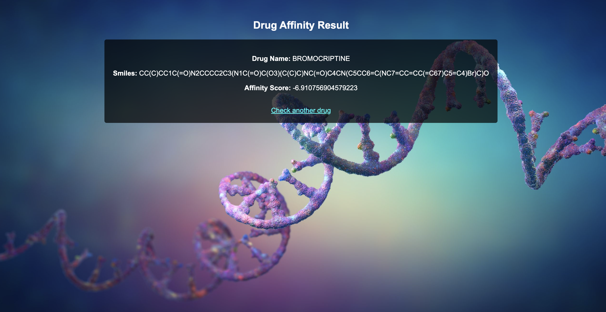
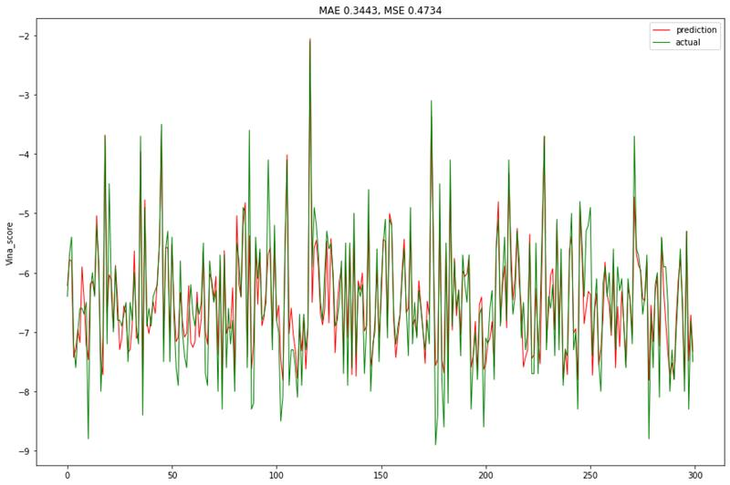
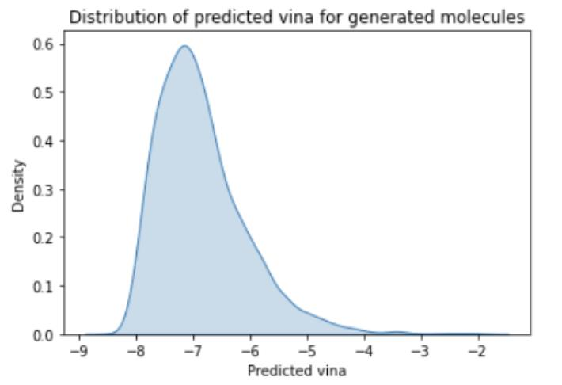

# **Repurposing of Drugs for SARS-CoV-2 Virus using Ensemble Learning and Generative Adversarial Networks to Create Similar and High Performing Molecules**
 
## **Authors**  
**Viren Varma | Mohd. Adain W**  
 
## **Abstract**  
The **severe acute respiratory syndrome coronavirus 2 (SARS-CoV-2)** virus, responsible for the **Coronavirus disease 2019 (COVID-19)**, has caused massive loss to life and property. With no definitive cure, the virus continues to mutate into more powerful variants within mere months. Modern drug development procedures typically take **5-10 years** to bring a new drug to the market, making rapid intervention challenging.  
 
**Drug Repurposing** is an approach that tests existing market-approved drugs against the SARS-CoV-2 virus, enabling a **quick and safe line of treatment**. In this research, we propose a novel approach for drug repurposing using an **Artificial Neural Network (ANN) with an Ensemble Learning Algorithm**.  
 
Additionally, we utilize the **molecular fingerprint** of repurposed drugs as a dataset to train a **Generative Adversarial Network (GAN)**. The GAN functions as a differentiator to generate new **synthetic drug molecules** with similar or improved properties. These generated molecules can be synthesized and tested for further pharmaceutical applications.  
 
## **Key Terms**  
- **Drug Repurposing**  
- **Ensemble Learning**  
- **Generative Adversarial Network (GAN)**  
- **Random Forest Regressor**  
- **Molecular Fingerprinting**  
- **Artificial Neural Networks (ANNs)**  
- **Recurrent Neural Networks (RNNs)**  
 
---
 
## **I. Introduction**  
 
SARS-CoV-2 shares a close genetic relationship with **SARS-CoV-1**, yet **no specific drugs** have been developed to target it directly. The conventional drug development process requires **millions of dollars** and takes **5-10 years**, making it infeasible for an immediate solution.  
 
One effective strategy for viral treatment is the **inhibition of viral proteases** necessary for the proteolytic processing of polyproteins. This strategy has been successfully used for **HIV** and **Hepatitis C** treatments. Similarly, the **main protease (Mpro)** of SARS-CoV-2 plays a crucial role in viral replication, making it a **promising target for antiviral drug development**.  
 
### **Current Computational Drug Repurposing Approaches**  
1. **Molecular Docking**: Existing drug compounds are screened for their ability to bind with the **SARS-CoV-2 Mpro crystal structure**.  
2. **Shape Screening & Docking Protocols**: Multiple docking simulations determine the molecular descriptors relevant to pharmacokinetics.  
3. **Molecular Dynamics Simulations**: Stability of the docked molecules is evaluated, and ligand binding energies are quantified.  
4. **Off-Target Binding Evaluation**: Ensures that the proposed drugs are commercially viable.  
 
### **Our Approach**  
1. **Molecular Fingerprinting** of drug molecules using **SMILES representation**.  
2. **Artificial Neural Network (ANN)** to predict binding affinity to **Mpro enzyme**.  
3. **Generative Adversarial Network (GAN)** to generate novel molecular structures with optimized binding affinity.  
4. **Machine Learning and High-Performance Computing (HPC)** to accelerate the drug discovery pipeline.  
 
---
 
## **II. Background**  
 
### **1. Drug Repurposing**  
Drug repurposing leverages **FDA-approved medications** for new therapeutic applications, reducing time and cost while maintaining safety standards. Advances in **Artificial Intelligence (AI) and Machine Learning (ML)** have revolutionized **big data-driven drug discovery**, enabling faster identification of potential candidates.  
 
### **2. Molecular Fingerprinting**  
Molecular fingerprinting involves training unsupervised **ML models** to represent chemical compounds as vectors. This approach enables efficient property prediction and mitigates challenges such as **sparseness and bit collisions** in conventional chemical descriptors.  
 
### **3. Ensemble Learning**  
Ensemble Learning improves prediction accuracy by combining outputs from multiple ML models. We employ the **bagging and stacking methods** to construct the **discriminator and generator models** in our **GAN framework**.  
 
### **4. Recurrent Neural Networks (RNNs)**  
RNNs process **sequential data**, making them ideal for handling **SMILES-based chemical structure representations**. Unlike traditional **Deep Neural Networks (DNNs)**, RNNs retain past information through **memory-based processing**, improving accuracy in sequence-dependent predictions.  
 
### **5. Generative Adversarial Networks (GANs)**  
GANs consist of:  
- **Generator Model**: Generates synthetic molecular structures.  
- **Discriminator Model**: Classifies the generated molecules based on binding affinity predictions.  
- The **adversarial training** refines the model until the discriminator accepts synthetic molecules as valid chemical compounds.  
 
---
 
## **III. Data Collection and Molecular Fingerprinting**  
 
### **Dataset Collection**  
- **ChEMBL Database**: A repository of **2M+ bioactive compounds** with drug-like properties.  
- **Docking Scores and Binding Energies**: Data compiled from previous SARS-CoV-2 **docking simulations** (Pant et al., 2020; Fischer et al., 2020; Kouznetsova et al., 2020; Agrawal et al., 2020).  
- **SMILES Representation**: Used for molecular fingerprinting and machine learning modeling.  
 
### **Molecular Feature Extraction**  
- **Mol2Vec**: Converts SMILES representations into **vector embeddings** to capture **chemical substructures**.  
- **Advantages over Traditional Representations**: Resolves **sparseness and bit collision issues** in molecular fingerprints.  
 
---
 
## **IV. Random Forest Regressor - Discriminator**  
 
- **Autodock Vina**: Scores molecular docking affinity based on **binding energy calculations**.  
- **Random Forest Regressor Model**:  
  - **Max depth = 7** (low variance, high accuracy).  
  - **Input**: Vectorized SMILES fingerprints.  
  - **Output**: Predicted binding affinity (Autodock Vina score).  
  - **Evaluation Metrics**:  
    - **Mean Absolute Error (MAE):** 0.3443  
    - **Mean Squared Error (MSE):** 0.4737  
    - **R² Score:** 0.8187  
 
---
 
## **V. Generative Adversarial Network (GAN)**  
 
- **Generator**: Stack-augmented **Recurrent Neural Network (RNN)** trained to create novel molecules.  
- **Discriminator**: Random Forest Regressor model from previous step.  
- **Training Process**:  
  - **Depth:** 200 layers, **Width:** 1500 neurons.  
  - **Optimizer:** Adadelta, **Learning Rate:** 0.01.  
  - **Gating Mechanism:** GRU (similar to LSTM but fewer parameters).  
- **Output**:  
  - **10,000 molecules generated**  
  - **6,321 valid molecular compounds** with strong predicted binding affinity.  
 
---
 
## **VI. Web Application**  
 
A **FastAPI-based web application** was developed to facilitate **rapid drug screening**.  
 
### **Features**  
1. **Real-time Prediction** of binding affinity for user-input compounds.  
2. **Comparison of Multiple Molecules** side by side.  
3. **Visualization** of molecular properties.  
4. **API Integration** for high-throughput drug screening.  
5. **Future Enhancements**:  
   - **Live Docking Simulations**  
   - **Drug Similarity Search**  

 
---
 
## **VII. Results and Future Scope**  
 
- **Phase 1**: Discriminator model achieved **high prediction accuracy**, validating its ability to approximate docking scores.  

- **Phase 2**: Generated **6,321 valid molecular compounds**, mapped against their predicted binding affinity.  

- **Long-term Impact**: AI-driven drug discovery can significantly **accelerate antiviral drug development** and **reduce costs**.  
 
### **Future Prospects**  
- **Lab Testing & Clinical Trials**: To validate computational predictions.  
- **Scaling up Drug Screening**: Integration with **high-performance GPUs** for faster screening.  
- **Expanding AI Models**: Adapting the framework for **other viral diseases**.  
 
---
 
## **Conclusion**  
 
Our approach **combines drug repurposing, AI-driven screening, and generative modeling** to create a **rapid and cost-effective solution for SARS-CoV-2 drug discovery**. This methodology can be expanded to other infectious diseases, **revolutionizing pharmaceutical research**.  